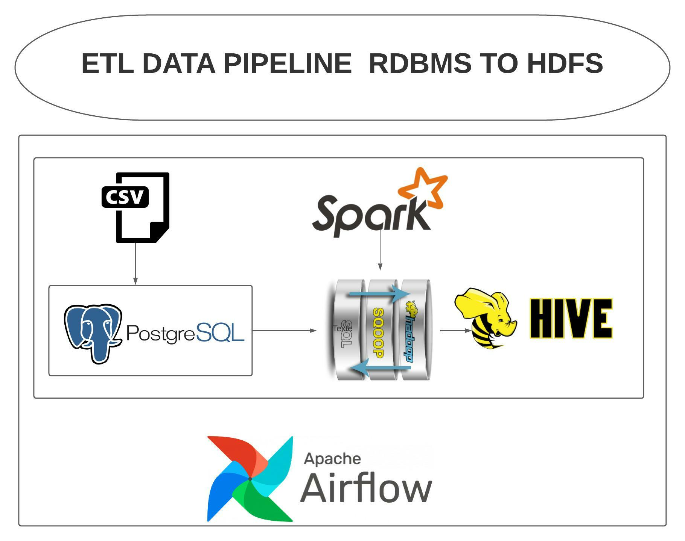

```
docker-compose up -d
```

Then you can access the Airflow UI webserver through port 8080
- http://localhost:8080

Please feel free to turn the dag button on for the `hands_on_test`.
It sets a `start_date` to days_ago(1) and schedule to run on a daily basis.

Assume that the pipeline is run completely. You can test the result on the following components like this.


## HIVE

```
# show tables
docker exec hive-server beeline -u jdbc:hive2://localhost:10000/default -e "SHOW TABLES;"
```

```
# describe table
docker exec hive-server beeline -u jdbc:hive2://localhost:10000/default -e "SHOW CREATE TABLE <<TARGET TABLE>>;"

# change <<TARGET TABLE>> to your table name e.g., 'order_detail', 'restaurant_detail'
```

```
# sample data
docker exec hive-server beeline -u jdbc:hive2://localhost:10000/default -e "SELECT * FROM <<TARGET TABLE>> LIMIT 5;"

# change <<TARGET TABLE>> to your table name e.g., 'order_detail', 'restaurant_detail'
```

```
# check partitioned parquet
docker exec hive-server hdfs dfs -ls /user/spark/transformed_order_detail
docker exec hive-server hdfs dfs -ls /user/spark/transformed_restaurant_detail

# check the source of external table in ./airflow/scripts/hql script.
```

For SQL requirement files, the CSV files will be placed in the `./sql_result` when the dag is completed.

After you finish the test, you can close the whole application by
```
docker-compose down -v
```
